project Name : Doctor Hub

1 => Login page

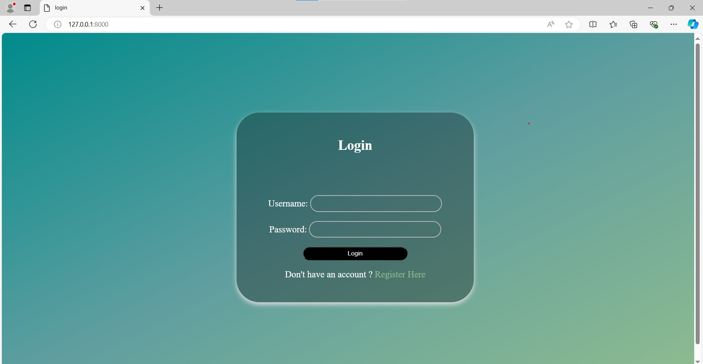

it validate that the user is registered

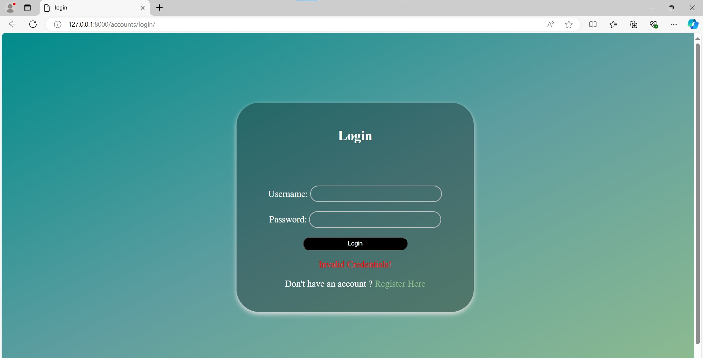

2 => Registration page

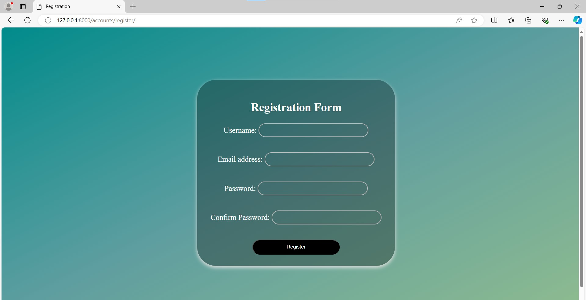

it make validation for all inputs

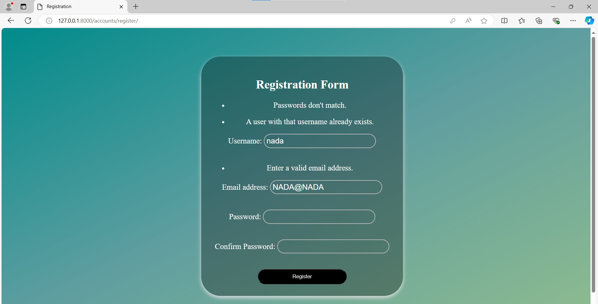

3 => Home page:
        1. displays all doctors in the system.

        2. contain to two dropdown to enable user to search about doctors.
        
        3. user can search by Area or Specialization or Both

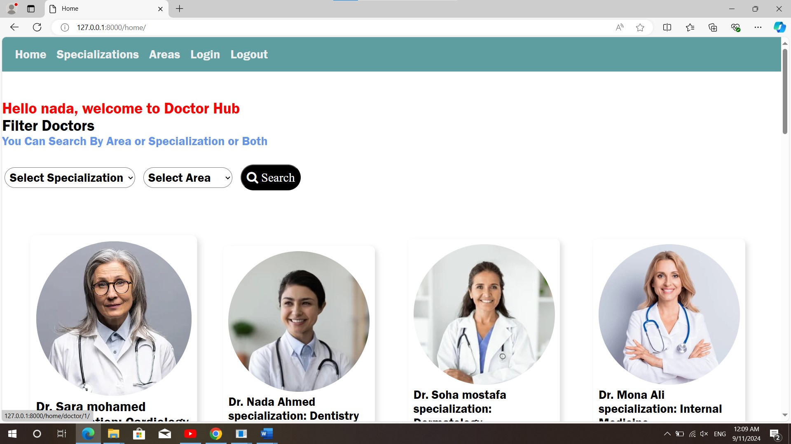
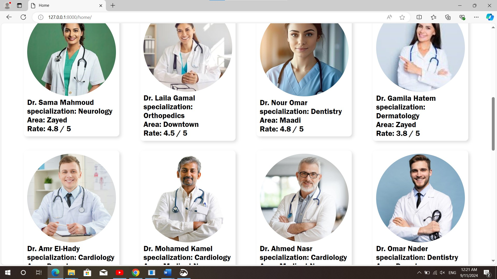            

4 => search page
        1. view doctors according to user choices

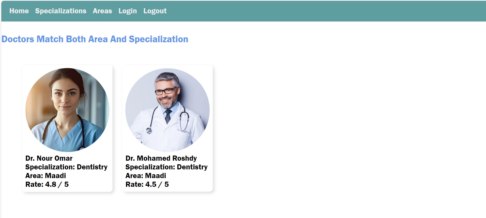
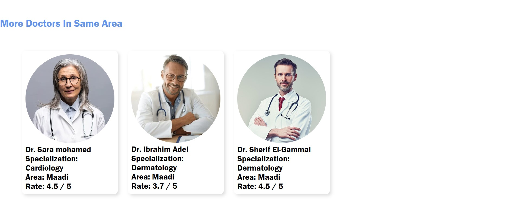
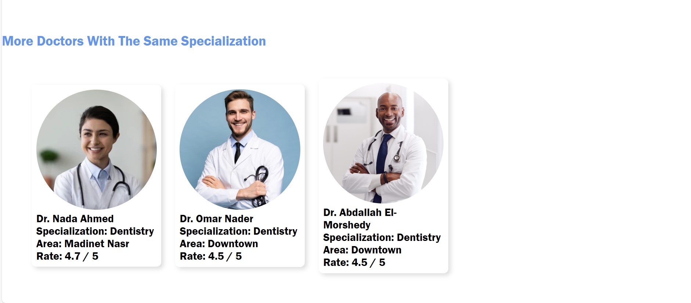

5 => Specializations gape and Areas page 
        1. contain all Specializations and Areas as links
        2. when user clicks he can see all doctors in this Area or Specialization

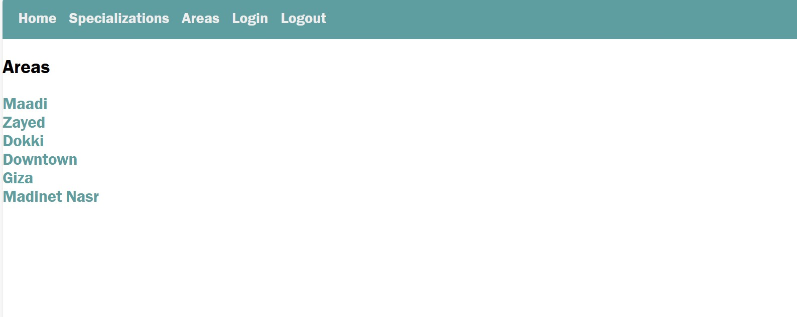
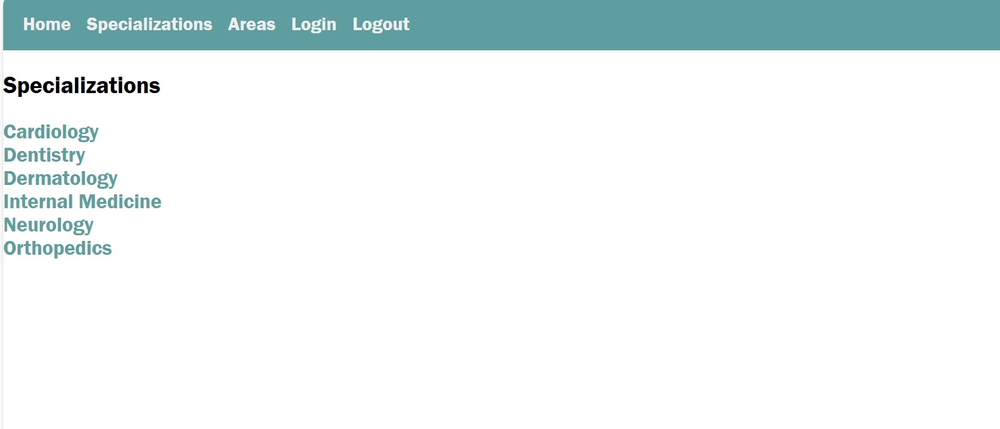

Ex : when user clicks Downtown the system view all doctors in Downtown with different Specializations

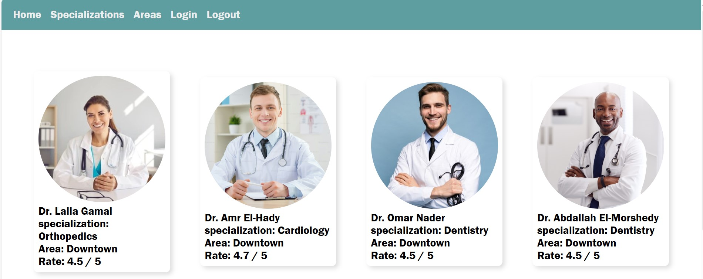

Ex : when user clicks Dentistry the system view all Dentists with different Areas

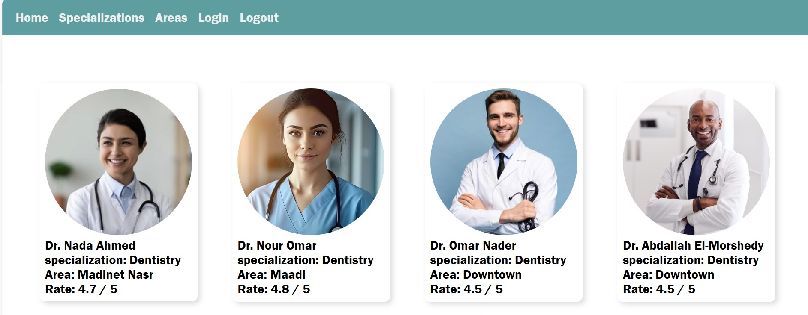